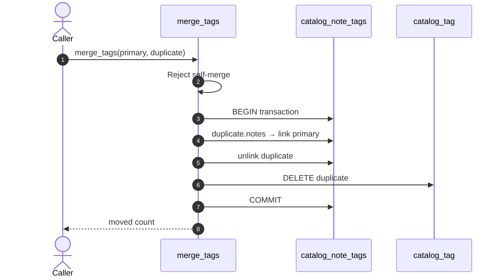

# PR: Add tag merging and note search

> Theme: **adding logic** (diff of `theme/adding-logic` against `theme/changing-dbs`).
> Written per [docs/pr-visual-review-style-guide.md](docs/pr-visual-review-style-guide.md).
>
> This PR changes no models and no migrations — so, per the guide, the schema
> sections are **absent**, not empty. Sections appear only when the PR touches
> what they describe; a pure-logic PR's visual aid is the flow it changes.

## 🎬 Flow: merging a duplicate tag

Included because this PR adds the code in this flow (`catalog/services.py`).
Steps 4–6 run inside `transaction.atomic()` — a failure mid-merge rolls back and
the duplicate tag survives untouched.

## 📊 Schema changes

None — no models or migrations touched. The most recent schema state is
[`theme/changing-dbs`](../theme/changing-dbs).

## Vocabulary

Colors and verbs per the pinned
[schema action vocabulary](docs/pr-visual-review-style-guide.md#2-action-vocabulary)
— none used here, which is itself the demonstration: no change, no visual noise.
