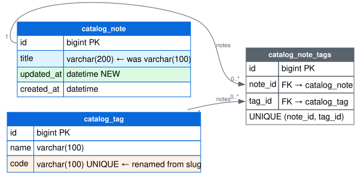

```dot
digraph changing_dbs {
  rankdir=LR
  node [shape=plaintext fontname="Helvetica"]

  Tag [label=<
    <TABLE BORDER="0" CELLBORDER="1" CELLSPACING="0" CELLPADDING="4" COLOR="#0969da">
      <TR><TD BGCOLOR="#0969da" COLSPAN="2"><FONT COLOR="white"><B>catalog_tag</B></FONT></TD></TR>
      <TR><TD ALIGN="LEFT" BGCOLOR="#fff1e5">code</TD><TD ALIGN="LEFT" BGCOLOR="#fff1e5">varchar(100) UNIQUE &#8592; renamed from slug</TD></TR>
    </TABLE>>];
  /* ...full source in docs/assets/changing-dbs.dot... */
}
```

# PR: Reshape the catalog schema — rename, alter, add, drop

> Theme: **changing DBs** (diff of `theme/changing-dbs` against `theme/creating-dbs`).
> Written per [docs/pr-visual-review-style-guide.md](docs/pr-visual-review-style-guide.md).
> One PR deliberately exercising every change type.

## 📊 Schema changes

🟢 additions · 🟠 renames · 🔵 modifications · 🔴 removals

| Change | Table | Column | Type |
|---|---|---|---|
| 🟠 `~ RENAME COLUMN` | catalog_tag | slug → code | varchar(100) UNIQUE |
| 🔵 `% ALTER COLUMN` | catalog_note | title | varchar(100) → varchar(200) |
| 🟢 `+ ADD COLUMN` | catalog_note | updated_at | datetime |
| 🔴 `− DROP COLUMN` | catalog_note | body | text |
| 🔴 `− DROP TABLE` | catalog_bookmark | — | 4 columns |

Dropped objects (🔴) never appear in the after-state diagram below — this table
and the raw block are their only home, so nothing is silently hidden (Rule 1).

<details>
<summary>Raw changes</summary>

```diff
~ RENAME COLUMN catalog_tag.slug TO code
% ALTER COLUMN catalog_note.title varchar(100) → varchar(200)
+ ADD COLUMN catalog_note.updated_at datetime
- DROP COLUMN catalog_note.body
- DROP TABLE catalog_bookmark (migration 0002)
```

</details>

## 🧭 Schema diff diagram

After-state. Blue header band = existing table, modified; the header of an
untouched table (`catalog_note_tags`) stays gray. Rows carry the change colors:
orange = renamed, blue = altered, green = new.

Read per the vocabulary: orange rows are the same data under a new name (safe);
the blue row changed the shape of existing data (the one to scrutinize — is
`varchar(100) → varchar(200)` correct for all existing rows?); green rows are
new data; the two 🔴 removals above are the complete list.



<details>
<summary>Graphviz source (regenerate: <code>dot -Tsvg -o docs/assets/changing-dbs.svg docs/assets/changing-dbs.dot</code>)</summary>



</details>

## Vocabulary

Colors and verbs per the pinned
[schema action vocabulary](docs/pr-visual-review-style-guide.md#2-action-vocabulary).
