# PR: Reshape the catalog schema — rename, alter, add, drop

## Summary

One migration (`0002`) reshaping the catalog schema, deliberately covering every change type so this PR doubles as the reference example for each.

- **~ RENAME `tag.slug` → `tag.code`** — the identifier shown in URLs and the API; `code` says what it is (the slug field type stays, so values are unchanged). Django generates a pure `RENAME`, no table rewrite
- **% ALTER `note.title` varchar(100) → varchar(200)** — API-imported titles overflowed 100; widening a varchar is safe in every direction that matters (no rewrite, no truncation of existing data)
- **+ ADD `note.updated_at`** (`auto_now`) — change tracking for API consumers. Existing rows backfill with the migration's timestamp; rows get their real touch time only after they are saved once — stated here so nobody expects a backdated history that does not exist
- **− DROP `note.body`** — the product decision: notes are now short title-only reminders. **This is destructive: stored bodies are deleted.** It is the change to sign off on consciously
- **− DROP `catalog_bookmark`** — unused since the first release; table and data are removed. If preservation were required, an export step would precede the drop — it was not required

## Invariants

- Every non-destructive change preserves existing data exactly (rename moves, widen keeps, add defaults) — verified below against data created before the migration
- The two destructive changes are the *complete* list: nothing else in this PR deletes data (Rule 1 — the summary table and raw block below are exhaustive)

## 📊 Schema changes

> Visual layer per [docs/pr-visual-review-style-guide.md](docs/pr-visual-review-style-guide.md).
> 🟢 additions · 🟠 renames · 🔵 modifications · 🔴 removals

| Change | Table | Column | Type |
|---|---|---|---|
| 🟠 `~ RENAME COLUMN` | catalog_tag | slug → code | varchar(100) UNIQUE |
| 🔵 `% ALTER COLUMN` | catalog_note | title | varchar(100) → varchar(200) |
| 🟢 `+ ADD COLUMN` | catalog_note | updated_at | datetime |
| 🔴 `− DROP COLUMN` | catalog_note | body | text |
| 🔴 `− DROP TABLE` | catalog_bookmark | — | 4 columns |

Dropped objects (🔴) never appear in the after-state diagram — this table and the raw block are their only home, so nothing is silently hidden.

<details>
<summary>Raw changes</summary>

```diff
~ RENAME COLUMN catalog_tag.slug TO code
% ALTER COLUMN catalog_note.title varchar(100) → varchar(200)
+ ADD COLUMN catalog_note.updated_at datetime
- DROP COLUMN catalog_note.body
- DROP TABLE catalog_bookmark (migration 0002)
```

</details>

## 🧭 Schema diff diagram

After-state. Blue header band = existing modified table; untouched (`catalog_note_tags`) stays gray. Rows: orange = renamed, blue = altered, green = new. The blue row is the one to scrutinize (does 200 fit every producer of `title`?); orange rows are same-data-new-name (safe); the 🔴 removals above are the exhaustive destructive list.

```dot
digraph changing_dbs {
  rankdir=LR
  node [shape=plaintext fontname="Helvetica"]

  Tag [label=<
    <TABLE BORDER="0" CELLBORDER="1" CELLSPACING="0" CELLPADDING="4" COLOR="#0969da">
      <TR><TD BGCOLOR="#0969da" COLSPAN="2"><FONT COLOR="white"><B>catalog_tag</B></FONT></TD></TR>
      <TR><TD ALIGN="LEFT" BGCOLOR="#fff1e5">code</TD><TD ALIGN="LEFT" BGCOLOR="#fff1e5">varchar(100) UNIQUE &#8592; renamed from slug</TD></TR>
    </TABLE>>];
  /* ...full source in docs/assets/changing-dbs.dot... */
}
```


<details>
<summary>Graphviz source (regenerate: <code>dot -Tsvg -o docs/assets/changing-dbs.svg docs/assets/changing-dbs.dot</code>)</summary>



</details>

## Testing

- `manage.py migrate` against a db created at migration `0001` (pre-existing rows) — applies cleanly
- Verified against pre-migration data: `Tag.code` readable and unique-constraint enforced; `Note.body` gone; `Note.updated_at` present; surviving note's `title` intact; `Bookmark` unimportable (dropped)
- `manage.py check` — clean
