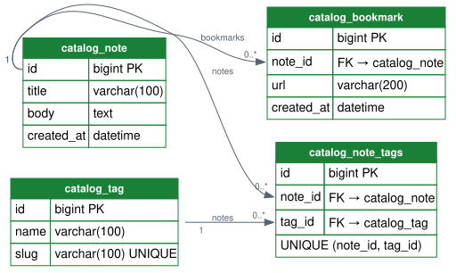
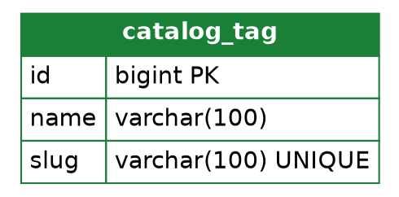

# PR: Add the catalog schema — Note, Tag, Bookmark

> Theme: **creating DBs** (diff of `theme/creating-dbs` against `main`).
> Written per [docs/pr-visual-review-style-guide.md](docs/pr-visual-review-style-guide.md).
> The schema sections are included because this PR changes `catalog/models.py` and `catalog/migrations/`.

## 📊 Schema changes

🟢 additions · 🟠 renames · 🔵 modifications · 🔴 removals

| Change | Table | Column | Type |
|---|---|---|---|
| 🟢 `+ CREATE TABLE` | catalog_tag | — | 3 columns |
| 🟢 `+ CREATE TABLE` | catalog_note | — | 4 columns |
| 🟢 `+ CREATE TABLE` | catalog_note_tags | — | 3 columns, 1 unique (m2m junction, created by `Add field tags to note`) |
| 🟢 `+ CREATE TABLE` | catalog_bookmark | — | 4 columns |
| 🟢 `+ ADD COLUMN` | catalog_note | tags | m2m → catalog_tag |

<details>
<summary>Raw changes</summary>

```diff
+ CREATE TABLE catalog_tag        (id, name, slug UNIQUE)
+ CREATE TABLE catalog_note       (id, title, body, created_at)
+ CREATE TABLE catalog_note_tags  (id, note_id FK → catalog_note, tag_id FK → catalog_tag, UNIQUE (note_id, tag_id))
+ CREATE TABLE catalog_bookmark   (id, note_id FK → catalog_note, url, created_at)
```

</details>

## 🧭 Schema diff diagram

All four tables are new — green header bands, green borders. Green means new
data; nothing existed here before.



<details>
<summary>Graphviz source (regenerate: <code>dot -Tsvg -o docs/assets/creating-dbs.svg docs/assets/creating-dbs.dot</code>)</summary>



</details>

## Vocabulary

Colors and verbs per the pinned
[schema action vocabulary](docs/pr-visual-review-style-guide.md#2-action-vocabulary).
