# PR Visual Review Style Guide

> How we present code changes in pull requests so that human, visual readers can
> understand them at a glance. The living, rendered example of every rule below
> is `pr-visual-mock.html` in the repository root — open it in a browser.

## 1. Principles

**Rule 1 — never hide a change.** The PR description is a *layer over* the net schema
diff, never a *curation* of it. Every change operation (create, add, rename,
alter, drop) must appear in the comment. Omission is only allowed as an explicit
count ("2 more changes — expand"), never as silence. A reader must never have to
wonder *what else the comment didn't tell them*. This rule is enforced in CI:
a test asserts that each operation from the diff is present in the generated
comment, so a dropped fact fails the build instead of misleading a reviewer.

**Rule 2 — diff against the base branch, not migration history.** Within one PR,
migration chains must coalesce to their net result (`CreateModel` followed by
`RenameField` is a new table with the final name — nothing "renamed" exists
against the base branch). A column whose in-PR history genuinely matters (e.g. a
security-relevant rename) may carry a provenance annotation such as
`(migration 0004)`, but the net state is what the diagram shows.

**Rule 3 — verbs name their object type.** "Rename what?" is never a question
the reader has to ask. The action cell reads `RENAME COLUMN`, `DROP TABLE`,
`ADD COLUMN` — never a bare `RENAME`.

## 2. Action vocabulary

Every schema change uses exactly one of these forms. The vocabulary card is
pinned once on the repository and linked from every PR description.

| Action | Symbol | Row format | In the diagram |
|---|---|---|---|
| CREATE TABLE | `+` | `+ CREATE TABLE integrations_calendar` | Green header band + green border |
| ADD COLUMN | `+` | `+ ADD COLUMN users_user.timezone varchar(64) DEFAULT 'UTC'` | Green row inside the table |
| ADD INDEX / UNIQUE | `+` | `+ ADD UNIQUE integrations_gmailmessage (mailbox, gmail_id)` | Badge in the type cell |
| RENAME COLUMN | `~` | `~ RENAME COLUMN integrations_gmailmailbox.refresh_token → encrypted_refresh_token` | Orange row, old → new in the type cell |
| RENAME TABLE | `~` | `~ RENAME TABLE integrations_oldapp → integrations_app` | Orange header band, old → new |
| ALTER COLUMN | `%` | `% ALTER COLUMN users_user.email varchar(254) → text NULL` | Blue row, old type → new type |
| DROP COLUMN | `−` | `− DROP COLUMN users_user.last_name` | Absent from the after-diagram; summary + diff block only (Rule 1) |
| DROP TABLE | `−` | `− DROP TABLE integrations_oldapp_widget` | Absent from the after-diagram; summary + diff block only (Rule 1) |

## 3. Color semantics

Colors carry meaning; they are not decoration. The palette is GitHub's own diff
palette so the colors feel native to the review surface.

| Color | Meaning | Background | Accent | Symbol |
|---|---|---|---|---|
| Green | new data | `#dafbe1` | `#1a7f37` | `+` |
| Red | gone | `#ffebe9` | `#cf222e` | `−` |
| Orange | same data, new name — safe | `#fff1e5` | `#bc4c00` | `~` |
| Blue | shape of existing data changed — review carefully | `#ddf4ff` | `#0969da` | `%` |

Read: green = new data, red = gone, orange = re-identified (no data change),
blue = reshaped (type/default/nullability changed — the one to look at closely).

Two weights per color: **header bands** (table-name bars) use the saturated
accent with white bold text; **row backgrounds** use the pale background from
the table above. Legends must show both weights — the accent swatch for tables,
the pale swatch for rows — never one swatch standing in for the other.

## 4. The schema diagram

### Standard: Graphviz table-grid ERD (primary visual)

Graphviz renders the primary image: grid-aligned columns, colored header bands,
per-row `BGCOLOR`, and ports anchoring FK edges to the exact FK column —
deterministic layout, no auto-layout surprises. Render in CI
(`dot -Tsvg`, posted as PNG):

When GitHub strips the HTML tables, or when a high-fidelity image is wanted,
render the same diagram with Graphviz HTML-like labels (`dot -Tsvg`, posted as
PNG). Graphviz gives aligned columns, header bands, and per-row `BGCOLOR`
natively, with ports anchoring FK edges to the exact FK column:

```dot
digraph schema_diff {
  rankdir=LR
  node [shape=plaintext fontname="Helvetica"]
  User [label=<
    <TABLE BORDER="0" CELLBORDER="1" CELLSPACING="0" CELLPADDING="4" COLOR="#0969da">
      <TR><TD BGCOLOR="#0969da" COLSPAN="2"><FONT COLOR="white"><B>users_user</B></FONT></TD></TR>
      <TR><TD ALIGN="LEFT" PORT="u_id">id</TD><TD ALIGN="LEFT">bigint PK</TD></TR>
      <TR><TD ALIGN="LEFT" BGCOLOR="#dafbe1">timezone</TD><TD ALIGN="LEFT" BGCOLOR="#dafbe1">varchar(64) NEW</TD></TR>
    </TABLE>>];
  Mailbox [label=<
    <TABLE BORDER="0" CELLBORDER="1" CELLSPACING="0" CELLPADDING="4" COLOR="#1a7f37">
      <TR><TD BGCOLOR="#1a7f37" COLSPAN="2"><FONT COLOR="white"><B>integrations_gmailmailbox</B></FONT></TD></TR>
      <TR><TD ALIGN="LEFT" PORT="m_user">user_id</TD><TD ALIGN="LEFT">FK &#8594; users_user</TD></TR>
    </TABLE>>];
  User:u_id -> Mailbox:m_user [taillabel="1", headlabel="0..1", label="gmail_mailbox"]
}
```



### Fallback: Mermaid `flowchart` with table-grid nodes (text-native)

The same diagram as a Mermaid block, kept because text survives where images
don't — email, CLI — and stays diffable in the comment source:

- One node per table, built from a real HTML `<table>` in the label:
  left-aligned column names, right-aligned types.
- Header band (colored by table state, white bold text) carries the table name.
- Row background colors follow the vocabulary (green new column, orange
  renamed, blue altered).
- FK edges labeled with cardinality and relation name: `|"1 : 0..1 gmail_mailbox"|.
- Removed objects never appear — the diagram shows the *after* state; Rule 1
  keeps them visible in the summary and diff block.
- **Hide the node rect** so the HTML table is the node visual (the flowchart
  equivalent of Graphviz's `shape=plaintext`) — otherwise mermaid draws a
  padded default box around every table:

  ```text
  classDef plain fill:none,stroke:none
  class User,Mailbox,SyncRun,Message plain
  ```

```text
flowchart LR
    User["<table border='1' cellspacing='0' cellpadding='3'><tr><td colspan='2' bgcolor='#0969da' style='color:#fff'><b>users_user</b></td></tr><tr><td align='left'>id</td><td align='right'>bigint PK</td></tr><tr><td align='left' bgcolor='#dafbe1'>timezone</td><td align='right' bgcolor='#dafbe1'>varchar(64) NEW</td></tr></table>"]
    Mailbox["<table border='1' cellspacing='0' cellpadding='3'><tr><td colspan='2' bgcolor='#1a7f37' style='color:#fff'><b>integrations_gmailmailbox</b></td></tr><tr><td align='left' bgcolor='#fff1e5'>encrypted_refresh_token</td><td align='right' bgcolor='#fff1e5'>text ← renamed</td></tr></table>"]
    User -->|"1 : 0..1 gmail_mailbox"| Mailbox
```

### Mermaid gotchas (found the hard way — do not rediscover)

1. **Use `flowchart`, never `classDiagram`**, for anything styled.
   `classDiagram` `classDef` support is unreliable: it breaks with relationship
   lines, with most style names, and with classDef-before-application order —
   silently, without errors.
2. **`classDef` style names must be lowercase.** CamelCase names like
   `newTable` are silently dropped in Mermaid 11 — no error, no color. Use
   `green`, `blue`, etc.
3. `erDiagram` supports no styling at all — do not use it for diffs.
4. `htmlLabels` accept real `<table>` markup: `bgcolor`, `align`, and `style`
   survive Mermaid's DOMPurify sanitizer locally. **Verify once with a real PR
   comment** that GitHub's server-side sanitizer behaves the same before
   committing fully to this form.

## 5. Flow diagrams

Flows that reviewers always ask about (OAuth, sync/recovery, request lifecycles)
get a checked-in Mermaid `sequenceDiagram`, auto-linked in the PR description when
the diff touches files in that flow. Pin down notable steps in prose beneath the
diagram ("step 10 is where the token is encrypted").

## 6. PR description layout

**Prose first.** A PR description is a real description with the visual layer
riding on top; visuals never replace it. A visuals-only PR is a slideshow, not
a description. Order:

1. **Summary** — what this PR does and why, one bullet per concern,
   information-dense (API surface, data, rollout, monitoring, docs...).
2. **Decisions & invariants** — the design choices worth a reviewer's conscious
   sign-off (deliberate `CASCADE`, a destructive drop) and the guarantee this
   PR must preserve ("no request can observe another user's data").
3. **Testing** — what was verified and the concrete result, not an aspiration.
4. **Schema changes** (visual) — colored action table in the vocabulary format
   plus a raw `diff`-fenced block. Fastest read; authoritative record (Rule 1).
   Present only when models/migrations changed.
5. **Schema diff diagram** (visual) — the Graphviz render (primary image). A
   table-grid Mermaid variant can be included when email/CLI readers matter;
   it is a fallback, not the default.
6. **Affected flow diagrams** (visual) — sequence diagrams for flows the PR
   touches.
7. A link to the pinned vocabulary card.

A section appears only when the PR touches what it describes — a pure-logic PR
has no schema section at all (absent, not empty). Long raw lists collapse
behind `<details>`, but their contents are complete — collapsing is fine,
hiding is not.

## 7. Rendering notes on GitHub

- Mermaid blocks render natively inside comments, issues, and the PR
  description — no attachments needed; they also survive email and CLI reading.
- ` ```diff ` fenced blocks get GitHub's green/red coloring for +/- lines.
- Attached images render constrained to comment width and open full-size on
  click, so "too large" is not a problem — no need to downscale deliberately.
- UI changes: attach a short GIF or screen recording; GitHub plays them inline.

## 8. For human PR authors

- Keep the description's **visual index** section: link whatever applies —
  schema diff, flow diagrams, screenshots/GIFs.
- Small PRs beat annotated PRs — visuals are a floor for comprehension, not a
  substitute for reviewable size.
- When you name a change in prose, use the vocabulary verbs and colors so prose
  and generated comments read the same.